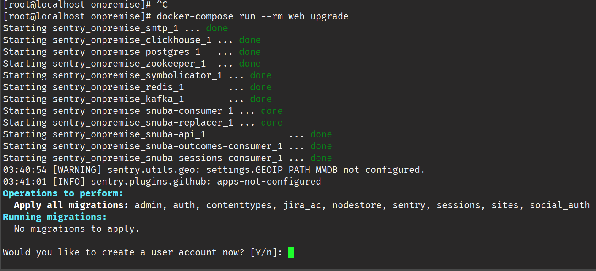
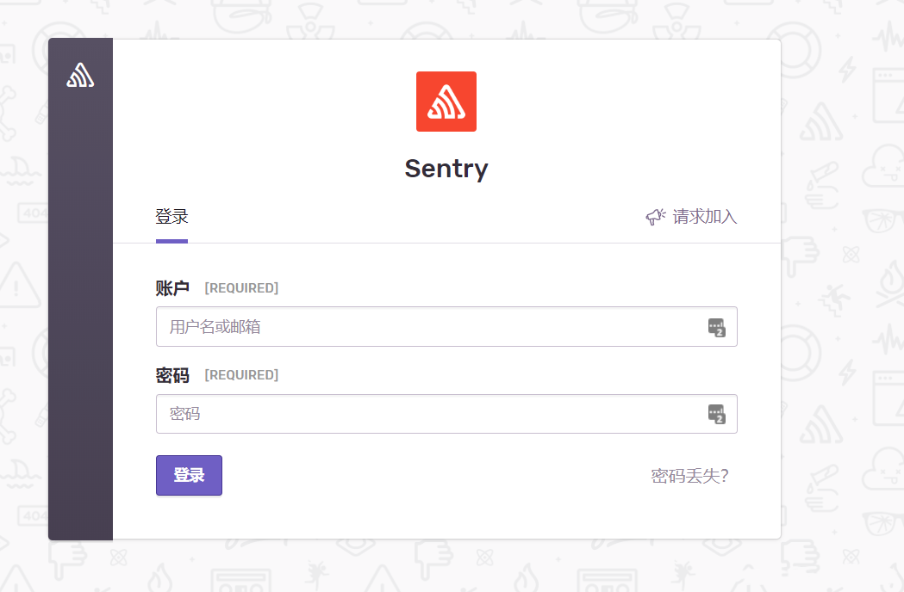
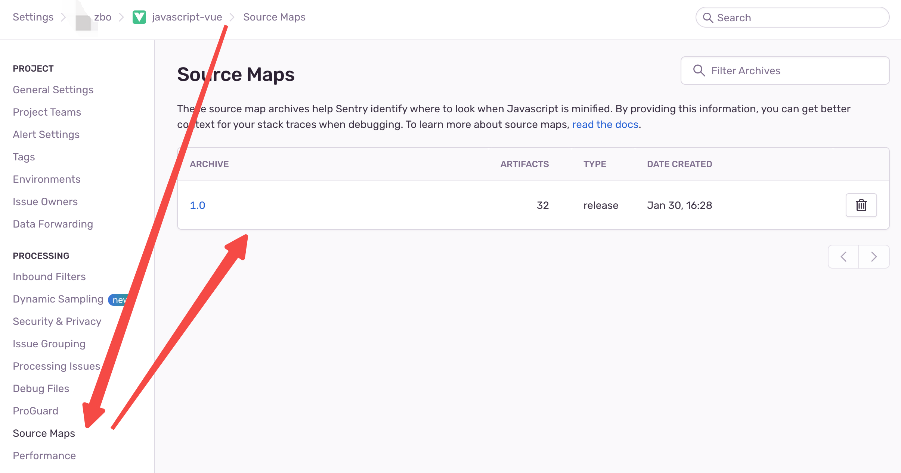

# sentry

> [https://develop.sentry.dev/self-hosted/](https://develop.sentry.dev/self-hosted/)

Sentry 是一个流行的错误监控平台，帮助开发者分析，修复问题，优化代码的性能。可以进行错误捕获，问题追踪，并提供问题详情，适用于多个平台，多种语言。

本章主要介绍如何私有化部署 sentry, 以及搭建 sentry 环境，实现前端监控平台的搭建。

## 私有化部署 sentry

> [项目地址](https://github.com/getsentry/self-hosted)

主要采用 docker 实现部署。

### 环境需要:

* Docker 19.03.6+
* Compose 1.28.0+
* 4 CPU Cores
* 8 GB RAM
* 20 GB Free Disk Space
* git 1.8.0.0+
* python 3

---

1. `docker` `docker compose` 安装

* [docker 安装](/buildtools/jenkins.html#安装-docker)

* [docker compose 安装](https://www.runoob.com/docker/docker-compose.html)

> `docker`  `docker compose` 安装完成后启动 docker!。

```bash
sudo systemctl start docker
```

2. `git`,`python3`安装

```bash
yum install git python3
```

### 项目准备

此处已 `sentry 22.11.0` 版本为示例，可以根据自身需求安装最新版本，具体版本查看 [https://develop.sentry.dev/self-hosted/](https://develop.sentry.dev/self-hosted/)

```bash
/* 克隆项目 */
git clone https://github.com/getsentry/self-hosted
/* 切换分支(此处貌似不切换分支会出现问题) */
cd self-hosted
git checkout 22.11.0
```

### 配置 docker 镜像加速

此处尽量配置 docker 镜像加速，不然拉取资源速度很慢

[推荐使用阿里云镜像加速链接](https://cr.console.aliyun.com/cn-hangzhou/instances/mirrors)

### 安装项目

配置完镜像加速后，即可直接执行 shell 脚本命令

```bash
./install.sh
/* 如果 git 链接不稳，可以跳过 commit 检查 */
./install.sh --skip-commit-check
/* 提示权限不足可以执行下面这条命令对文件夹赋权 */
chmod 777 ./*
```

等几分钟。看到下图就是安装完成了



选择 `Y` ，创建一个账号和密码

> 不小心点了 n 咋办?

重新运行下面的命令，会在让你输入一个账户的

```bash
docker - compose run--rm web upgrade
```

### 运行 docker

创建账号和密码完成后，项目的基本配置就已经结束了，接下来直接运行项目即可

```bash
docker-compose up -d
```

然后浏览器访问 **http://{ip}:9000** , IP 改成自己服务器的 ip 地址。默认是 9000 端口



## Vue3.0 集成 sentry

### 下载依赖

* @sentry/vue
* @sentry/tracing
* vite-plugin-sentry

```bash
yarn add @sentry/vue @sentry/tracing
```

### 引入依赖

在 `/src/mian.ts` 中引入依赖包，此处可查看[sentry 官方教程](https://docs.sentry.io/platforms/javascript/guides/vue/#vue-3)

```js
import {
    createApp
} from "vue";
import {
    createRouter
} from "vue-router";
import * as Sentry from "@sentry/vue";
import {
    BrowserTracing
} from "@sentry/tracing";

const app = createApp({
    // ...
});
const router = createRouter({
    // ...
});

Sentry.init({
    app,
    dsn: "https://84e093ad22194ca8ab6eaf7a8a0d9087@o4504565504999424.ingest.sentry.io/4504565506441216",
    integrations: [
        new BrowserTracing({
            routingInstrumentation: Sentry.vueRouterInstrumentation(router),
            tracePropagationTargets: ["localhost", "my-site-url.com", /^\//],
        }),
    ],
    // Set tracesSampleRate to 1.0 to capture 100%
    // of transactions for performance monitoring.
    // We recommend adjusting this value in production
    tracesSampleRate: 1.0,
});

app.use(router);
app.mount("#app");
```

### 生产模式上传 SourceMap

在生产环境中上传 SourceMap 以方便定位出现问题的源码位置, 此处可查看[官方配置教程](https://www.npmjs.com/package/vite-plugin-sentry)

```bash
/* 安装依赖 */
yarn add vite-plugin-sentry
```

```js
// vite.config.ts
// other declarations
import type {
    ViteSentryPluginOptions
} from "vite-plugin-sentry";
import viteSentry from "vite-plugin-sentry";

/*
  Configure sentry plugin
*/
const sentryConfig: ViteSentryPluginOptions = {
    url: "https://sentry.io",
    authToken: "<SECRET_TOKEN_HERE>",
    org: "my_org",
    project: "my_project",
    release: "1.0",
    deploy: {
        env: "production",
    },
    setCommits: {
        auto: true,
    },
    sourceMaps: {
        include: ["./dist/assets"],
        ignore: ["node_modules"],
        /**
         * This sets an URL prefix at the beginning of all files.
         * This defaults to `~/` but you might want to set this to the full URL.
         * This is also useful if your files are stored in a sub folder. eg: url-prefix `~/static/js`.
         */
        urlPrefix: "~/assets", // url前缀：该参数应设置为源码映射文件的url前缀。可参考下面注意事项
    },
};

export default defineConfig({
    // other options
    plugins: [viteSentry(sentryConfig)],
    build: {
        // required: tells vite to create source maps
        sourcemap: true,
    },
});
```

上传成功后，可在 sentry 平台 Project -> settings -> Source Maps 中查看 SourceMap 是否上传成功



当看到 soucemap 确实上传成功后，并不代表源码映射已完成，可能此时看到的错误仍然无法准确的映射到源码。

此处需要几个方面来排查，sentry 也提供了一些工具来帮助我们验证和检查源码映射。[Sentry Validating Files](https://docs.sentry.io/platforms/javascript/guides/vue/sourcemaps/validating/)

::: warning 注意事项
其实最有可能出现映射异常的问题就是 `urlPrefix` 参数设置失败，下面用举例的方式来说明该参数如何配置：

比如我们的 js 文件访问地址为：http://www.pipef.top/vue3admin/assets/index.73cac8e8.js

那么此处 `urlPrefix` 应该设置为 `~/vue3admin/assets`

:::

TODO:

* 配置 ssl, 并解决 User. IP 不能正常展示问题
* 性能指标的一些专业术语解释

## 参考文献

* [从零搭建 Sentry](https://blog.csdn.net/maomaolaoshi/article/details/128203552)

* [sentry 官网 VUE 集成教程](https://docs.sentry.io/platforms/javascript/guides/vue/)

* [vuejs 官网推荐](https://cn.vuejs.org/guide/best-practices/production-deployment.html#tracking-runtime-errors)
