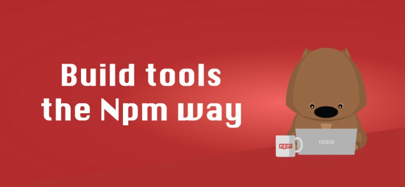

# npm scripts 使用指南

Node 开发离不开 npm，而脚本功能是 npm 最强大、最常用的功能之一。

本文介绍如何使用 npm 脚本（npm scripts）。

## 学习地址

- <a href="http://www.ruanyifeng.com/blog/2016/10/npm_scripts.html" target = "_blank">npm scripts 使用指南--阮一峰</a>
- [npm script官方文档](https://www.npmjs.cn/)
