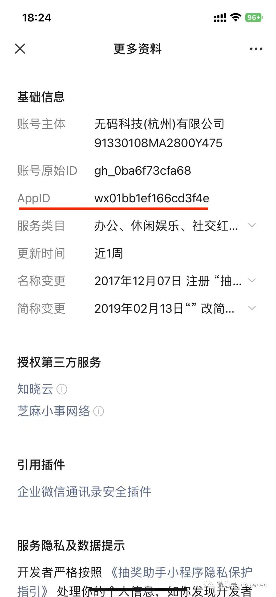
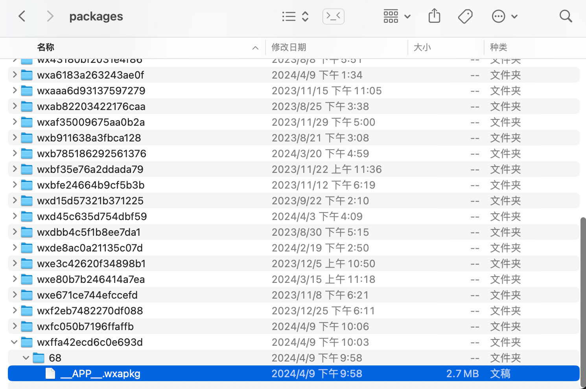

# Penetration Testing 渗透测试

## 微信小程序逆向

macos 逆向微信小程序非常简单， `mac版本的微信小程序是没有做加密的，可以直接反编译`

- 找到微信小程序文件位置

  `mac 版微信小程序的位置： /Users/xxx/Library/Containers/com.tencent.xinWeChat/Data/.wxapplet/packages/` ，其中 xxx 表示你的电脑用户名称

- 根据 AppId 找到对应小程序的包`__APP__.wxapkg`

  

  

  将包复制一份儿到待操作的文件夹

- 直接使用`wxappUnpacker`解包

  [https://github.com/Leocat81/wxappUnpacker](https://github.com/Leocat81/wxappUnpacker)

  下载源码，安装 node 环境，下载 npm 包，执行命令

  ```bash
  node wuWxapkg.js /Users/sijunfeng/Desktop/__APP__.wxapkg
  ```

  🏅️ 即可看到反编译后的源码包
