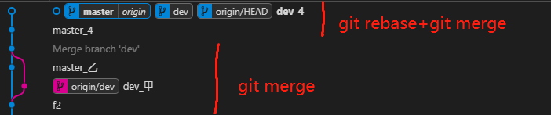

# Git

   git 版本回滚有两种方式，其一为`Git Reset`,其二为`Git Revert`。下面来看这种具体操作及实现。文末对两种方式进行总结和比较。

## 克隆

`git clone`用于拉取远程仓库到本地

```bash
/* git clone 远程仓库地址 本地目录 */
$ git clone https://gitee.com/pipepandafeng/blog_vuecode.git blog_vuecode_local
```

## 拉取

`git fetch` 和`git pull` 都用于代码和分支的更新。

- <h3>git fetch</h3>

一旦远程主机的版本库有了更新（Git 术语叫做 commit），需要将这些更新取回本地，这时就要用到 git fetch 命令。

```bash
/*
 * git fetch 主机名 远程分支:本地分支（创建一个新分支）
 * 特别注意:不建议本地分支写本地已有分支，否则拉取当有冲突时可能会有问题
*/
##1：拉取更新到本地新建tmp分支
$ git fetch origin master:tmp
##2：合并更新
$ git merge tmp
##3: 当有冲突时，手动解决冲突 然后git add .| git commit -m ""。无冲突时 最后直接push
$ git push origin master
```

- <h3>git pull</h3>

```bash
/*
 * git pull 主机名 远程分支:本地分支（无则创建一个新分支）
*/
##1：取回origin主机的master分支，与本地的dev分支合并
## || 如果远程分支是与当前分支合并，则冒号后面的部分可以省略。
$ git pull origin master:dev || git pull origin master
##2: 当有冲突时，手动解决冲突 然后git add .| git commit -m ""。无冲突时 最后直接push
$ git push origin master
```

::: tip 结论
git fetch 是从远程获取最新版本到本地，但不会自动 merge。
而 git pull 则是会获取所有远程索引并合并到本地分支中来。效果相同时 git pull 将更为快捷。
:::

## 分支

- <h3>基础操作</h3>

- `git branch`用于查看本地分支
- `git branch -a`查看所有分支（包括远程分支）
- `git branch XXX`新建一个分支
- `git checkout master` 切换分支
- `git checkout -t orgin/master` 本地创建一个 master 并建立一个追踪关系，自动追踪远程分支（origin/master)

- <h3>同步本地与线上分支</h3>

🔔 将线上新增分支更新到本地

第一种方式：拉取分支不创建本地分支,其后一步完成创建分支与建立追踪关系

```bash
##1：拉取远程分支(不创建本地分支)
$ git pull || git fetch
##2：建立本地分支与远程分支的追踪关系
$ git checkout -t orgin/XXX
```

第二种方式 拉取分支就创建本地分支，但此时追踪关系未创建，其后手动建立追踪关系

```bash
##1：拉取远程分支（本地没有的话，创建与远程分支同名的本地分支）
git pull origin XXX || git fetch origin XXX:XXX
##2：手动指定本地分支与远程分支的追踪关系
$ git branch --set-upstream-to=origin/master master
```

🔔 将线上删除分支更新到本地

如果远程主机删除了某个分支，默认情况下，git pull 不会在拉取远程分支的时候，删除对应的本地分支。这是为了防止，由于其他人操作了远程主机，导致 git pull 不知不觉删除了本地分支。

但是，你可以改变这个行为，加上参数 -p 就会在本地删除远程已经删除的分支。

```bash
$ git pull -p
# 等同于下面的命令
$ git fetch --prune origin
$ git fetch -p
```

- <h3>追踪关系（tracking）</h3>

查看分支跟踪的远程分支

```bash
$ git branch --vv

  dev    04c3d8f [origin/dev] update README.md.
  dev1   6203f67 [origin/dev1] update README.md.
* master d672abc [origin/master] update README.md.
  tmp    219538d update README.md.

```

在某些场合，Git 会自动在本地分支与远程分支之间，建立一种追踪关系（tracking）。比如，在 git clone 的时候，所有本地分支默认与远程主机的同名分支，建立追踪关系，也就是说，本地的 master 分支自动"追踪"origin/master 分支。

Git 也允许手动建立追踪关系。

```bash
##该命令指定master分支追踪origin/next分支。
$ git branch --set-upstream master origin/next
##该命令创建一个本地 master 并建立一个追踪关系，自动追踪远程分支（origin/master)
$ git checkout -t orgin/master
```

如果<b>当前分支</b>与远程分支存在追踪关系，git pull 就可以省略远程分支名。

```bash
##该命令表示，本地的当前分支自动与对应的origin主机"追踪分支"（remote-tracking branch）进行合并。
$ git pull origin
```

<b>如果当前分支只有一个追踪分支</b>，连远程主机名都可以省略。

```bash
$ git pull
```

## 冲突

`git merge`和`git rebase`都用于解决冲突

- `git log --oneline --graph --decorate --all` 以树形式查看 git 提交历史记录
- vscode 中 `Git Graph` 也可以以树形式查看 git 提交历史记录

其下所有例子均假设有两个分支`master，dev`。`master` 分支和 `dev` 有无冲突两种情况，现需要将 `dev` 分支合并到 `master` 上。

<h3>1️⃣ git merge</h3>

- 无冲突

```bash
$ git checkout master
$ git merge dev
$ git push origin master
```

- 有冲突

```bash
$ git checkout master
$ git merge dev
## 手动解决冲突
$ git add .
$ git commit -m "dev merge to master"
$ git push origin master
```


可以看到当仅仅使用 git merge 处理冲突时，再主分支上会出现一条分叉分支，通过合并冲突后，
分叉的分支再次合并到主分支上，此时会多一条 commit,用于描述合并信息。git merge 操作简单，
但对 git history 提交历史看上去不太友好，接下来我们使用 git rebase 结合 git merge 使用，
以打到优化 git hostory 效果。

<h3>2️⃣ git rebase 结合 git merge 处理冲突</h3>

- 无冲突

```bash
$ git checkout dev
$ git rebase master
$ git checkout master
$ git merge dev
$ git push origin master
```

- 有冲突

```bash
$ git checkout dev
$ git rebase master
## 手动解决冲突
$ git rebase --continue
## 如还有冲突，继续手动解决冲突
## 最坏情况，比如提交了三次，每次都有冲突，则需重复此步骤三次
## 可以使用 git rebase -i 将多个commit 合并为一个commit，从而只解决一次冲突即可
$ git rebase --continue
## 冲突全部解决完成
$ git checkout master
$ git merge dev
$ git push origin master
```



::: tip

- 用 rebase 解决冲突时，可以随时使用 git rebase --abort 退出，将代码退回 rebase 之前。
- 可以使用 git rebase -i 将多个 commit 合并为一个 commit，从而只解决一次冲突即可。避免对此执行 git reabse --continue

:::

可以看到当使用 git rebase 结合 git merge 后，我们的 Git History 变为了线性排序，利于我们查看 git 的历史信息。

<h3>3️⃣ git pull –rebase 处理冲突</h3>

与上面解决冲突同理
git rebase master

<h3>4️⃣ git rebase -i HEAD~</h3>

- <a href="https://www.jianshu.com/p/ec45ce13289f" target="_blank">修改已经 push 的 commit message</a>

## 回滚

`git reset`和`git revert`都可用于代码版本回滚

<h3> 1️⃣ git reset </h3>

`git rese`是回退到某个 commit ID 版本位置

```bash
# 查询commitID
$ git log
# 执行版本回退
$ git reset --hard [commitID]
# 强制push代码到远程仓库
$ git push -f
```

<h3> 1️⃣ git revert </h3>

`git revert`是撤销某个 commit ID 版本，会撤销某个 commitID 的提交。

```bash
# 查询commitID
$ git log
# 执行版本回退
$ git revert -n [commitID]
# 出现冲突就解决冲突，如无冲突
$ git commit -m "版本名"
# push代码到远程仓库
$ git push
```


::: warning

- `git reset`是回退到某个 commitID 版本历史，`git revert`是撤销某个 commitID 得提交。

- `git reset`不会保留 commitID 之后的提交记录，`git revert`不会对 commitID 之前和之后的 commit 产生影响，但会生成一个新的 commit。

:::
