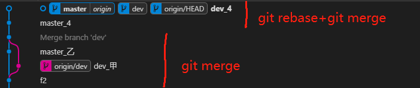

# 冲突

`git merge`和`git rebase`都用于解决冲突

- `git log --oneline --graph --decorate --all` 以树形式查看 git 提交历史记录
- vscode 中 `Git Graph` 也可以以树形式查看 git 提交历史记录

其下所有例子均假设有两个分支`master，dev`。`master` 分支和 `dev` 有无冲突两种情况，现需要将 `dev` 分支合并到 `master` 上。

<h3>🧯 git merge</h3>

- 无冲突

```bash
$ git checkout master
$ git merge dev
$ git push origin master
```

- 有冲突

```bash
$ git checkout master
$ git merge dev
## 手动解决冲突
$ git add .
$ git commit -m "dev merge to master"
$ git push origin master
```


可以看到当仅仅使用 git merge 处理冲突时，再主分支上会出现一条分叉分支，通过合并冲突后，
分叉的分支再次合并到主分支上，此时会多一条 commit,用于描述合并信息。git merge 操作简单，
但对 git history 提交历史看上去不太友好，接下来我们使用 git rebase 结合 git merge 使用，
以打到优化 git hostory 效果。

<h3>🧯 git rebase 结合 git merge 处理冲突</h3>

- 无冲突

```bash
$ git checkout dev
$ git rebase master
$ git checkout master
$ git merge dev
$ git push origin master
```

- 有冲突

```bash
$ git checkout dev
$ git rebase master
## 手动解决冲突
$ git rebase --continue
## 如还有冲突，继续手动解决冲突
## 最坏情况，比如提交了三次，每次都有冲突，则需重复此步骤三次
## 可以使用 git rebase -i 将多个commit 合并为一个commit，从而只解决一次冲突即可
$ git rebase --continue
## 冲突全部解决完成
$ git checkout master
$ git merge dev
$ git push origin master
```



::: tip

- 用 rebase 解决冲突时，可以随时使用 git rebase --abort 退出，将代码退回 rebase 之前。
- 可以使用 git rebase -i 将多个 commit 合并为一个 commit，从而只解决一次冲突即可。避免对此执行 git reabse --continue

:::

可以看到当使用 git rebase 结合 git merge 后，我们的 Git History 变为了线性排序，利于我们查看 git 的历史信息。

<h3>🧯 git pull –rebase 处理冲突</h3>

与上面解决冲突同理
git rebase master

<h3>🧯 git rebase -i HEAD~</h3>

- <a href="https://www.jianshu.com/p/ec45ce13289f" target="_blank">修改已经 push 的 commit message</a>
