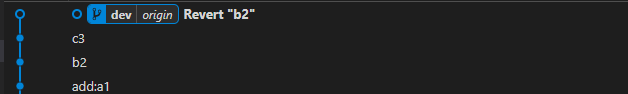

# 回滚

`git reset`和`git revert`都可用于代码版本回滚

<h3> 🧽 git reset </h3>

`git rese`是回退到某个 commit ID 版本位置

```bash
# 查询commitID
$ git log
# 执行版本回退
$ git reset --hard [commitID]
# 强制push代码到远程仓库
$ git push -f
```

<h3> 🧽 git revert </h3>

`git revert`是撤销某个 commit ID 版本，会撤销某个 commitID 的提交。

```bash
# 查询commitID
$ git log
# 执行版本回退
$ git revert -n [commitID]
# 出现冲突就解决冲突，如无冲突
$ git commit -m "版本名"
# push代码到远程仓库
$ git push
```



::: warning

- `git reset`是回退到某个 commitID 版本历史，`git revert`是撤销某个 commitID 得提交。

- `git reset`不会保留 commitID 之后的提交记录，`git revert`不会对 commitID 之前和之后的 commit 产生影响，但会生成一个新的 commit。

:::
