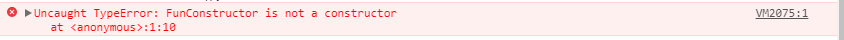

# 箭头函数和普通函数的区别

## 主要区别

  <p>箭头函数</p>
  
  ```js
  let addUser=()=>{
      console.log("添加一个用户")
  }
  ```
  <p>普通函数</p>
  
  ```js
function addUser(){
      console.log("添加一个用户")
  }
  ```
- <p class="diff">区别1:箭头函数使用箭头命名，普通函数中没有。</p>

- <p class="diff">区别2:箭头函数都为匿名函数，普通函数可以为匿名函数，也可以为具体名函数。</p>

- <p class="diff">区别3:箭头函数不能用于构造函数(不可以使用new) ,普通函数可以。</p>

```JS
let FunConstructor = () => {
    console.log('lll');
}

let fc = new FunConstructor();
```



- <p class="diff">区别4：箭头函数不绑定`arguments`，取而代之用rest参数...解决(`arguments` 是一个对应于传递给函数的参数的类数组对象。)</p>

```JS
function A(a){
  console.log(arguments);
}
A(1,2,3,4,5,8);  //  [1, 2, 3, 4, 5, 8, callee: ƒ, Symbol(Symbol.iterator): ƒ]


let B = (b)=>{
  console.log(arguments);
}
B(2,92,32,32);   // Uncaught ReferenceError: arguments is not defined


let C = (...c) => {
  console.log(c);
}
C(3,82,32,11323);  // [3, 82, 32, 11323]
```

## this

- <p class="diff">区别5：箭头函数不绑定this，会捕获其所在的上下文的this值，作为自己的this值</p>

```JS
var obj = {
  a: 10,
  b: () => {
    console.log(this.a); // undefined
    console.log(this); // Window {postMessage: ƒ, blur: ƒ, focus: ƒ, close: ƒ, frames: Window, …}
  },
  c: function() {
    console.log(this.a); // 10
    console.log(this); // {a: 10, b: ƒ, c: ƒ}
  }
}
obj.b();
obj.c();
```

<p class="code_title">例子1</p>

```JS
var name = 'window';

var A = {
   name: 'A',
   sayHello: function(){
      var s = () => console.log(this.name)
      return s//返回箭头函数s
   }
}

var sayHello = A.sayHello();
sayHello();// 输出A

var B = {
   name: 'B';
}

sayHello.call(B); //还是A
sayHello.call(); //还是A

```

<p class="code_title">例子2</p>

OK，这样就做到了永远指向 A 对象了，我们再根据<b>“该函数所在的作用域指向的对象”</b>来分析一下：

- 该函数所在的作用域：箭头函数 s 所在的作用域是 sayHello,<b>因为 sayHello 是一个函数。</b>(该函数所指的为箭头函数，<b>只有函数才有作用域（也就是 sayHello)</b>，也就是箭头函数所在的函数 this 即为箭头函数的 this)
- 作用域指向的对象：A.sayHello 指向的对象是 A。
- 所以箭头函数 s 中 this 就是指向 A 啦 ～～

<p class="error_example">下面看一个错误例子</p>

```js
var A = {
  name: "A",
  sayHello: {
    name: "B",
    print: () => {
      console.log(this.name);
    },
  },
};
var name = "c";
A.sayHello.print(); //输出为 "c"
```

<p class="code_title">例子3</p>
为什么这里既没有输出B,也没有输出A呢，请记住上面那句话，<b>该函数所在作用域指向的对象</b>。在这个例子中，箭头函数所在的作用域既非sayHello，也非A，因为他们都不是函数，非函数是没有作用域的,this只能用在函数中，对象中是没有this的。这里箭头函数所在的作用域为window(在浏览器中)，故输出为“c"。

<h3>总结：箭头函数this在定义时就已经确定了，不会更改了。箭头函数this永远为该函数所在作用域指向的对象（结合上面例子仔细理解这句话）</h3>

::: tip 结论

- 普通函数：函数的调用方式决定了  this  的值（运行时绑定）
- 箭头函数：箭头函数不会创建自己的 this,它只会从自己的作用域链（只有函数才有作用域）的上一层继承 this

:::

// TODO:补充 this

## 参考文献

- <a href="https://es6.ruanyifeng.com/#docs/class" target="_blank">阮一峰.《class this 指向》</a>
- <a href="https://developer.mozilla.org/zh-CN/docs/Web/JavaScript/Reference/Operators/this" target="_blank">MDN. 《this 指向详解》</a>
- <a href="https://developer.mozilla.org/zh-CN/docs/Web/JavaScript/Reference/Functions/Arrow_functions" target="_blank">MDN.《箭头函数 this 指向详解》</a>
- <a href="https://github.com/ljianshu/Blog/issues/7" target="_blank">ljianshu.《你还没搞懂 this？》</a>

<style scoped>
      .diff{
          letter-spacing:2px;
      }
      .code_title{
        text-align:center;
        font-size:12px;
      }
      .error_example{
        font-size:15px;
        color:red;
      }
</style>
