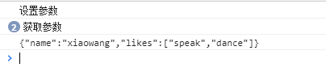
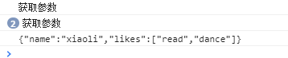

# 简单模拟数据劫持

在实现简单模拟数据劫持之前，让我们先来了解一下 ECMAScript 对象的属性类型

## 对象的属性类型

ECMAScript 中有两种属性：<span class="point_text">数据属性</span>和<span class="point_text">访问器属性</span>。

### 一 ： 数据属性

数据属性包含一个数据值的位置。在这个位置可以读取和写入值。数据属性有 4 个描述其行为的特性。

- [[Configurable]]：表示能否通过 delete 删除属性从而重新定义属性，能否修改属性的特性，或者能否把属性修改为访问器属性。默认值为 true。
- [[Enumberable]]：表示能否通过 for-in 循环返回属性。默认值为 true。
- [[Writable]]：表示能否修改属性的值。默认值为 true。
- [[Value]]：包含这个属性的数据值。读取属性值的时候，从这个位置读；写入属性值的时候，把新值保存在这个位置。默认值为 undefined。

<span class="point_text">要修改属性默认的特性，必须使用 ES5 的 Object.defineProperty()方法。</span>

```JS {3-4}
let person = {}
Object.defineProperty(person, 'name', {

    configurable:false,  // 不能删除该属性,不能修改属性的特性，不能访问访问器属性
    writable:false, // 不能进行赋值操作
    value:'Niko'

})
console.log(person.name); // 'Niko'
delete person.name // 因为configurable为false, 在删除属性操作           非严格模式下不会发生任何操作，在严格模式下报错
console.log(person.name); // 'Niko'

console.log(person.name); // 'Niko'
 person.name='Simple' // 因为writable为false, 故赋值操作在非严格模式下不会发生任何操作，在严格模式下报错
console.log(person.name); // 'Niko'

```

<span class="warn_text">Object.defineProperty()方法可以被调用多次，但是把 configurable 特性设置为 false 之后就会有限制了。见下面例子：</span>

```js {3,8}
let person = {};
Object.defineProperty(person, "name", {
  configurable: false,
  value: "Niko",
});
// 抛出错误
Object.defineProperty(person, "name", {
  configurable: true,
  value: "Niko",
});
```

<span class="point_text">在调用 Object.defineProperty()方法创建一个新的属性时，如果不指定，configurable，Enumberable，Writable 特性的默认值都是 false。</span>

### 二 ：访问器属性

访问器属性不包含数据值；它们包含一对 getter 和 setter 函数（不过，这两个函数都不是必需的）。在读取访问器属性时，会调用 getter 函数，这个函数负责返回有效的值；在写入访问器属性时，会调用 setter 函数并传入新值，这个函数负责决定如何处理数据。访问器属性有如下 4 个特性。

- [[Configurable]]：表示能否通过 delete 删除属性从而重新定义属性，能否修改属性的特性，或者能否把属性修改为访问器属性。默认值为 true。
- [[Enumberable]]：表示能否通过 for-in 循环返回属性。默认值为 true。
- [[Get]]：在读取属性时调用的函数。默认值为 undefined。
- [[Set]]：在写入属性时调用的函数。默认值为 undefined。

<span class="point_text">访问器属性不能直接定义，必须使用 Object.defineProperty()来定义。请看下面的例子。</span>

```JS
var book = {
    _year: 2004,
    edition: 1
};

Object.defineProperty(book, "year", {
    get: function() {
        return this._year;
    },
    set: function(newValue) {
        if (newValue > 2004) {
            this._year = newValue;
            this.edition += newValue - 2004;
        }
    }
});

book.year = 2005;
alert(book.edition); //2
```

<span class="warn_text">定义多个属性</span>

```JS
var book = {};

Object.defineProperties(book, {
    _year: {
        writable: true,
        value: 2004
    },
    edition: {
        writable: true,
        value: 1
    },
    year: {
        get: function() {
            return this._year;
        },
        set: function() {
        if (newValue > 2004) {
            this._year = newValue;
            this.edition += newValue - 2004;
        }
        }
    }
});
```

## 数据劫持

### ES5 Object.defineProperty()

经过以上简单介绍对象的属性类型和 Object.defineProperty()方法，相信大家都已经想到了数据劫持实现方法了，实际就是使用对象访问器属性的 getter 和 setter 函数对数据变化进行拦截通知，下面直接上代码。

::: warning
`Object.defineProperty()`为 Es5 新特性，不能兼容 IE8 以下浏览器。
:::

```ts
let obj = {
  name: "xiaoli",
  likes: ["speak", "dance"],
};

// 遍历对象所有属性，给每个属性绑定拦截器
function observe(obj: any) {
  Object.keys(obj).forEach((element) => {
    reactive(obj, element, obj[element]);
  });
}

// 定义一个拦截器，劫持数据的变化并通知。
function reactive(obj: object, key: string, value: string | Array<string>) {
  Object.defineProperty(obj, key, {
    get: function() {
      console.log("获取参数");
      return value;
    },
    set: function(newVal) {
      console.log("设置参数");
      value = newVal;
    },
  });
}
observe(obj);
obj.name = "xiaowang"; // 这里进行的赋值操作，故见下图"设置参数"出现一次
console.log(JSON.stringify(obj)); // 这里进行的读取操作，故见下图"获取参数"出现两次
```



<h2>总结：以上即为简单的数据劫持模型</h2>

<span class="point_text">特别注意:setter 函数不能劫持到以下几种情况</span>

1：不能检测以下数组的变动

- 当你利用索引直接设置一个数组项时 例如 <span class="warn_code">`arr[indexOfItem] = newValue`</span>
- 当你修改数组的长度时，例如：<span class="warn_code">`arr.length = newLength`</span>

<span class="todo">TODO: 查阅资料，补充其他情况。</span>

以上面例子举例：

```js
observe(obj);
obj.likes[0] = "read"; // 这里实际只进入了getter，没有进入setter 故下图
console.log(JSON.stringify(obj));
```



### Proxy

<p class="codepart-title"> 👍➡️<a href="https://es6.ruanyifeng.com/#docs/proxy">阮一峰：Proxy</a>⬅️</p>

<span class="todo">实例：TODO:使用 proxy 实现观察者模式</span>

### Object.defineProperty()和 Proxy 区别

<p class="codepart-title"> 👍➡️<a href="https://mp.weixin.qq.com/s/SPoxin9LYJ4Bp0goliEaUw">数据劫持 OR 数据代理</a>⬅️</p>

::: tip

<P>
优势:Proxy 的第二个参数可以有 13 种拦截方法，比 Object.defineProperty() 要更加丰富,Proxy 作为新标准受到浏览器厂商的重点关注和性能优化，相比之下 Object.defineProperty() 是一个已有的老方法。
</p>
<P>
劣势:Proxy 的兼容性不如 Object.defineProperty() (caniuse 的数据表明，QQ 浏览器和百度浏览器并不支持 Proxy，这对国内移动开发来说估计无法接受，但两者都支持 Object.defineProperty()),不能使用 polyfill 来处理兼容性
</p>
:::

### 数据劫持的一些简单巧妙用法

- 巧妙的面试题
  <p> 问： 什么样的 a 可以满足 (a === 1 && a === 2 && a === 3) === true 呢？(注意是 3 个 =，也就是严格相等) </p>
  <p> 解决: 每次访问 a 返回的值都不一样，那么肯定会想到数据劫持(有其它解法) </p>

```js
let current = 0;
Object.defineProperty(window, "a", {
  get() {
    current++;
    console.log(current);
    return current;
  },
});
console.log(a === 1 && a === 2 && a === 3); // true
```

<style scoped>
.point_text{
    font-weight:600;
    font-size:18px;
    color:red;
}
.warn_text{
    font-weight:600;
    font-size:18px;
}
.warn_code code{
    font-size:16px;
    color:DarkOrange !important;

}
.todo{
    font-weight:600;
    font-size:18px;
    color:Blue !important;
}
.codepart-title{
 text-align:center;
 color:dodgerblue
}
.codepart-title a{
     color:dodgerblue
}
</style>
