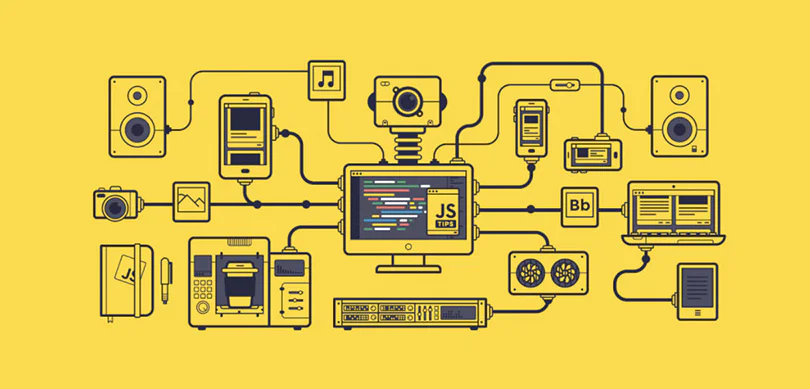

# javascript 执行机制



<p class="codepart-title"> 👍➡️ <a href="https://juejin.cn/post/6844903512845860872"  target = "_blank">
掘金优质博文：这一次，彻底弄懂JavaScript 执行机制
</a>⬅️</p>

```js
setTimeout(() => {
  var date3 = new Date(); //结束时间
  console.log(date3.getTime() - date1.getTime());
  console.log("object");
}, 2000);

var date1 = new Date(); //开始时间
for (let a = 0; a < 10000000000; a++) {
  // console.log(a);
}
var date2 = new Date(); //结束时间
console.log(date2.getTime() - date1.getTime());
```

<!-- TODO:完成js执行机制 -->

其他文献：[MDN-微任务与Javascript运行时环境](https://developer.mozilla.org/zh-CN/docs/Web/API/HTML_DOM_API/Microtask_guide/In_depth)

<style scoped>
.codepart-title{
 text-align:center;
 color:dodgerblue
}
.codepart-title a{
     color:dodgerblue
}
</style>
