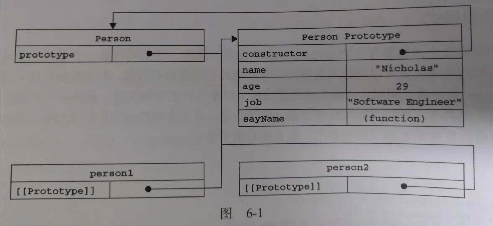

# 理解原型对象

理解原型对象之前，让我们先看一段代码。

```js
function Person(name, age, job) {
  Person.prototype.name = "somebody";
  Person.prototype.age = 29;
  Person.prototype.job = "tyloo";
  Person.prototype.sayName = function() {
    console.log(this.name);
  };
}
let person1 = new Person();
person1.sayName(); //somebody
let person2 = new Person();
person2.sayName(); //somebody
console.log(person1.sayName === person2.sayName); //true
```

此函数创建是遵循了 js 中原型模式而创建的函数，我们将 sayName()方法和所有属性直接添加到了 Person 的 prototype 属性中。即使如此，我们任然可以通过调用构造函数来创建对象，而且新对象还会具有相同的属性和方法。如果不理解上面代码也没关系，只需记住两点：

- Person.prototype 即为原型对象
- 实例（person1 或 person2）可以访问原型对象上的方法和属性。



图 6-1 展示了 Person 构造函数，Person 的原型属性以及现有的两个实例之间的关系。
