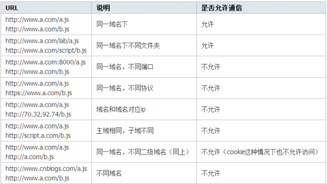

# 跨域与同源策略

跨域：指的是浏览器不能执行其他网站的脚本。它是由浏览器的同源策略造成的，是浏览器对javascript施加的安全限制。

同源策略：同源策略/SOP（Same origin policy）是一种约定，由Netscape公司1995年引入浏览器，它是浏览器最核心也最基本的安全功能，如果缺少了同源策略，浏览器很容易受到XSS、CSFR等攻击。所谓同源是指"协议+域名+端口"三者相同，即便两个不同的域名指向同一个ip地址，也非同源。

同源策略限制以下几种行为：
- Cookie、LocalStorage 和 IndexDB 无法读取
- DOM 和 Js对象无法获得
- AJAX 请求不能发送

## 常见跨域场景



## 跨域解决方案

- 通过jsonp跨域
- document.domain + iframe跨域
- location.hash + iframe
- window.name + iframe跨域
- postMessage跨域
- 跨域资源共享（CORS）
- nginx代理跨域
- nodejs中间件代理跨域
- WebSocket协议跨域

### JSONP
通常为了减轻web服务器的负载，我们把js、css，img等静态资源分离到另一台独立域名的服务器上，在html页面中再通过相应的标签从不同域名下加载静态资源，而被浏览器允许，基于此原理，我们可以通过动态创建script，再请求一个带参网址实现跨域通信。

``` JS
<!DOCTYPE html>
<html lang="en">
  <head>
    <meta charset="UTF-8" />
    <meta http-equiv="X-UA-Compatible" content="IE=edge" />
    <meta name="viewport" content="width=device-width, initial-scale=1.0" />
    <title>Document</title>
  </head>

  <body>
    <script>
      function success(params) {
        console.log(params);
      }
    </script>
    <script
      type="text/javascript"
      src="http://localhost:3000/upload?callback=success"
    ></script>
  </body>
</html>
```
<p class="code_title">🐬客户端🐬</p>

```js
var express = require("express");
var router = express.Router();

router.get("/", async (req, res, next) => {
  let func;
  if (req.originalUrl.indexOf("?") !== -1) {
    func = req.originalUrl.split("callback=")[1] + "('我真的')";
  }
  res.send(func);
});
module.exports = router;
```
<p class="code_title">🐕‍🦺node服务端🐕‍🦺</p>

::: tip
最后浏览器打印出 " 我真的 "
:::

### 跨域资源共享（CORS）

普通跨域请求：只服务端设置Access-Control-Allow-Origin即可，前端无须设置，若要带cookie请求：前后端都需要设置。

需注意的是：由于同源策略的限制，所读取的cookie为跨域请求接口所在域的cookie，而非当前页。如果想实现当前页cookie的写入，可参考下文：nginx反向代理中设置proxy_cookie_domain 和 NodeJs中间件代理中cookieDomainRewrite参数的设置。

目前，所有浏览器都支持该功能(IE8+：IE8/9需要使用XDomainRequest对象来支持CORS）)，CORS也已经成为主流的跨域解决方案。

### nginx反向代理跨域

::: warning
跨域原理： 同源策略是浏览器的安全策略，不是HTTP协议的一部分。服务器端调用HTTP接口只是使用HTTP协议，不会执行JS脚本，不需要同源策略，也就不存在跨越问题。
:::


实现思路：通过nginx配置一个代理服务器（域名与domain1相同，端口不同）做跳板机，反向代理访问domain2接口，并且可以顺便修改cookie中domain信息，方便当前域cookie写入，实现跨域登录。

nginx具体配置：

```
#proxy服务器
server {
    listen       81;
    server_name  www.domain1.com;

    location / {
        proxy_pass   http://www.domain2.com:8080;  #反向代理
        proxy_cookie_domain www.domain2.com www.domain1.com; #修改cookie里域名
        index  index.html index.htm;

        # 当用webpack-dev-server等中间件代理接口访问nignx时，此时无浏览器参与，故没有同源限制，下面的跨域配置可不启用
        add_header Access-Control-Allow-Origin http://www.domain1.com;  #当前端只跨域不带cookie时，可为*
        add_header Access-Control-Allow-Credentials true;
    }
}
```
### Nodejs中间件代理跨域

node中间件实现跨域代理，原理大致与nginx相同，都是通过启一个代理服务器，实现数据的转发，也可以通过设置cookieDomainRewrite参数修改响应头中cookie中域名，实现当前域的cookie写入，方便接口登录认证。

<p>对于vue框架：利用node + webpack + webpack-dev-server代理接口跨域。在开发环境下，由于vue渲染服务和接口代理服务都是webpack-dev-server同一个，所以页面与代理接口之间不再跨域，无须设置headers跨域信息了。<p>
webpack.config.js配置：

```js
module.exports = {
    entry: {},
    module: {},
    ...
    devServer: {
        historyApiFallback: true,
        proxy: [{
            context: '/login',
            target: 'http://www.domain2.com:8080',  // 代理跨域目标接口
            changeOrigin: true,
            secure: false,  // 当代理某些https服务报错时用
            cookieDomainRewrite: 'www.domain1.com'  // 可以为false，表示不修改
        }],
        noInfo: true
    }
}
```

<style scoped>
p{
    text-indent:2rem;
}
  .code_title{
    text-align:center;
    font-size:14px;
  }
</style>