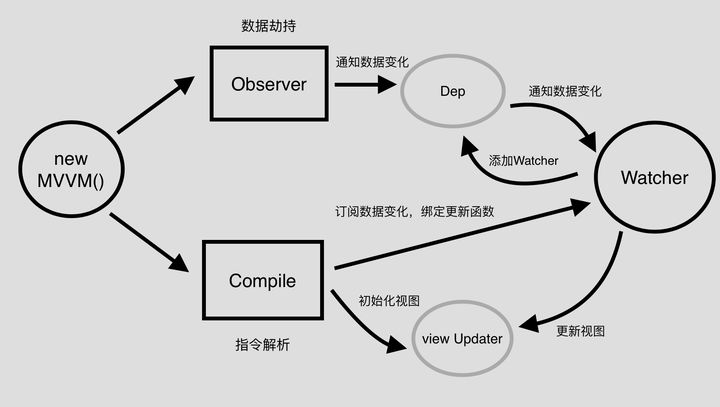

# vue 渲染机制

vue 通过render函数生产虚拟dom，解析相应的指令和模板语法。最后通过update挂载到实际的dom节点上。

## vue mvvm实现以及响应式原理

:::tip 结论1
vue是采用数据劫持配合发布者-订阅者模式，通过`Object.defineProperty()`去劫持各个属性的getter和setter,在数据变化时，发布消息给依赖收集器，去通知观察者，做出相应的监听回调，去更新视图
:::

:::tip 结论2
MVVM作为绑定的入口，整合了Observer,Compile和Watcher三者，通过Observe来监听model数据变化表，通过Compile来解析编译模板指令，最终利用Watcher搭起，Observer,Watcher之间的桥梁，达到数据变化=>视图更新;视图交互变化=>数据model变更的双向绑定效果。
:::
